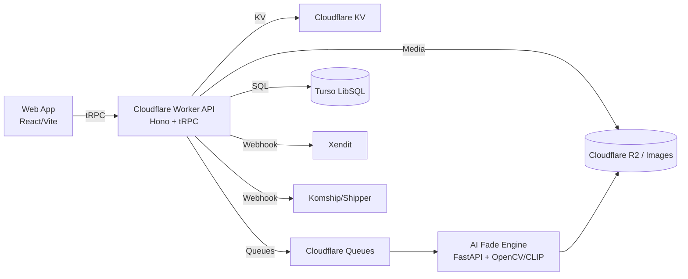
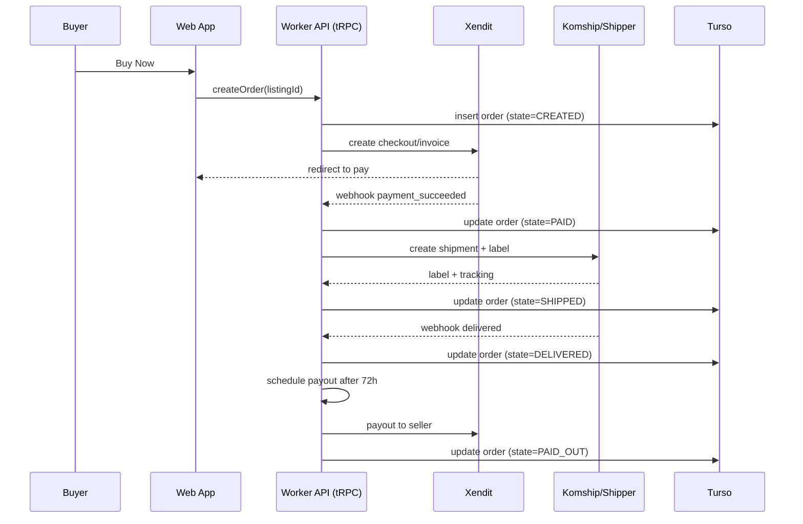
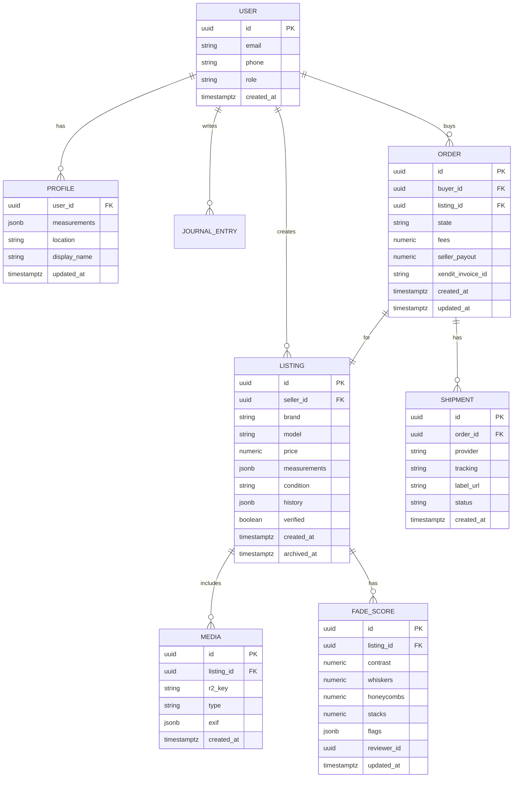
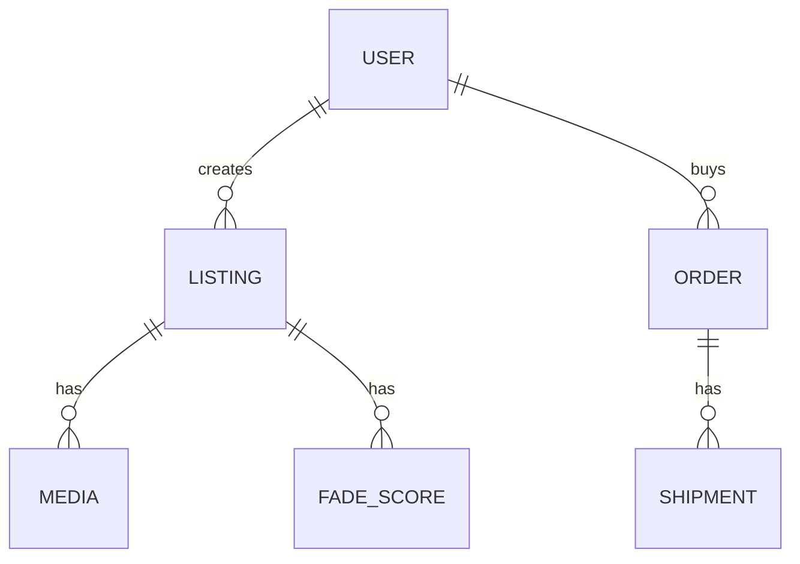
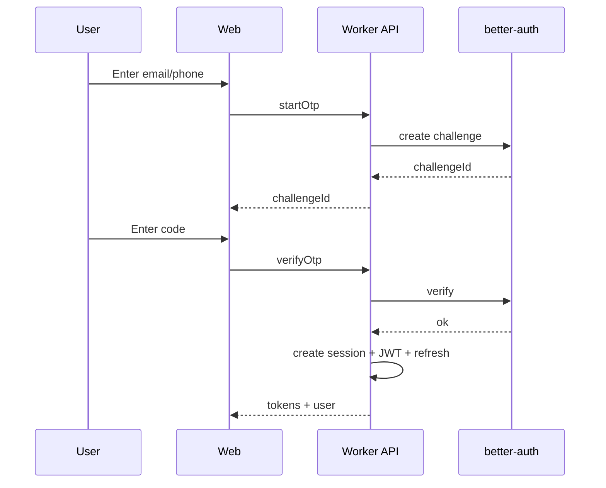
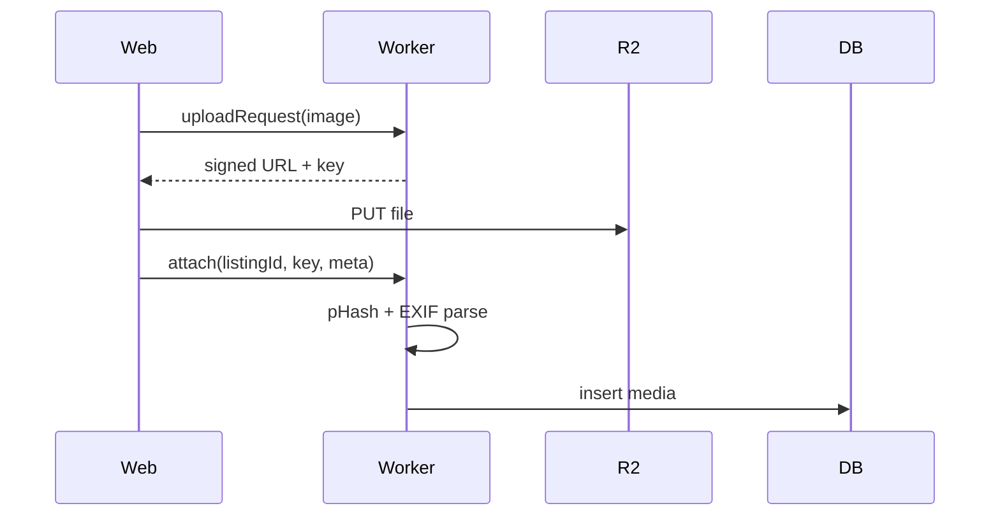
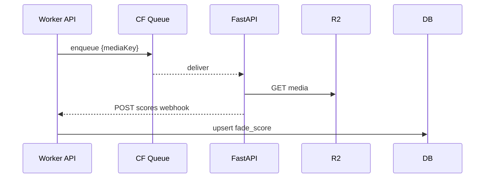
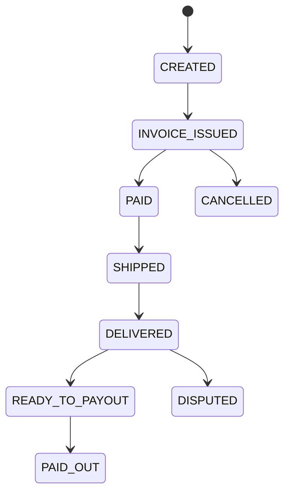

# 1. Business Requirements Document (BRD)

## Objective

Deliver Rugged Weave: a hybrid raw-denim marketplace that provides precise fit matching, verified fade authenticity, and a sustainable resale loop, optimized for Indonesia first, then Japan and the US.

## Stakeholders

* Founders / Executive
* Product Management
* Design & Research
* Engineering: Web, Edge API, AI/ML, DevOps
* Trust & Safety / Moderation
* Partnerships: Brands, Repair Shops
* Finance & Legal (KYC/AML, Consumer Protection)
* Customer Support / Community

## Business Goals

* Launch MVP with P2P listings, fit match, escrow payments, and shipping.
* Establish fade verification as a trust and culture differentiator.
* Onboard first 10 verified sellers and 3 brand partners by Month 6.
* Hit break-even by Month 18.

## Success Metrics

* ≥60% of new users complete body profile within 48 hours.
* ≥70% of searches return 20+ fit-relevant listings.
* <0.5% confirmed fake/abusive listings per month.
* > 95% on-time payouts; disputes <2% of orders.
* GMV: $60k Year 1, $300k Year 2; take-rate revenue per plan.
* ≥25% MAUs post to Fade Journals monthly.

---

# 2. Project Requirements Document (PRD)

## Scope

**In (MVP):** Auth, body profiles, listing CRUD, photo/video upload, AI fade scoring, search with fit-match ranking, checkout via Xendit, shipping via Komship/Shipper, order lifecycle, reviews/ratings, moderation dashboard, basic partner portal, Fade Journals, notifications.

**Out (v1):** AR try-on, NFT Fade ID, advanced auctions, complex international tax automation, AI grade marketplace for brands.

## Personas & User Stories

* **Buyer**

  * As a buyer, I enter measurements so listings rank by my fit.
  * As a buyer, I trust fade authenticity via AI score + verified badge.
  * As a buyer, I pay with Xendit and track shipping in one place.
* **Seller**

  * As a seller, I list jeans with detailed measurements and photos; AI pre-scores fades.
  * As a seller, I receive payout after delivery confirmation or dispute window.
* **Moderator**

  * As a moderator, I review flagged listings, detect photo reuse, and resolve disputes.
* **Brand Partner**

  * As a brand, I import SKUs, view orders, and access payout statements.

## Functional Requirements

1. **Registration & Auth**: better-auth OTP/passwordless + optional password; JWT sessions; OAuth (Google/Apple) via OIDC.
2. **Profiles & Measurements**: Height, weight, waist, thigh, front/back rise, knee, leg opening, inseam; unit toggle; privacy controls.
3. **Listings**: Title, brand/model, tagged size, measured size fields, condition, soak/wash history, price, media; draft/publish/archive; duplicate-photo detection.
4. **Search & Fit Match**: Filters; ranking by similarity between buyer body vector and listing measurements; sorting by price, recency, fade score.
5. **Fade Intelligence**: Upload → media pipeline → AI service returns scores (contrast, whiskers, honeycombs, stacks) + flags; manual override with audit.
6. **Payments (Escrow)**: Xendit hosted checkout/invoices; marketplace split; idempotent webhooks; payout after delivery + 72h dispute window.
7. **Shipping**: Komship/Shipper rates, labels, tracking; status via webhooks; address book.
8. **Orders**: Buy Now; state machine; cancellations before ship; dispute flows.
9. **Community**: Fade Journals (entries with photos/videos), comments, likes; basic anti-abuse.
10. **Moderation**: Queue, actions, strikes, appeal; media hashing for reuse.
11. **Partner Portal**: CSV import, stock status, order/payout views, basic analytics.
12. **Notifications**: Email + in-app; order, payout, moderation, social.

## Non-Functional Requirements

* **Scalability**: 20 RPS baseline, 200 RPS peak; image processing async.
* **Security**: JWT, RBAC, CSRF protection, rate limiting, captcha on risky flows, PII encryption at rest.
* **Privacy/Compliance**: Consent for analytics; audit logs; data retention policies.
* **Performance**: P95 < 300 ms for read APIs; first contentful paint < 2.5s on 4G.
* **Reliability**: 99.9% API availability; retries + idempotency keys.
* **Observability**: Logs, traces, metrics; error budgets and alerts.

## Acceptance Criteria (MVP)

* End-to-end: Listing → Checkout (Xendit) → Label → Delivery → Payout.
* Fit-ranked search produces deterministic results for same inputs.
* Fade score turnaround ≤30s; overrides audited.
* Disputes resolvable via moderator console.

---

# 3. Technical Design Document (TDD)

## System Architecture (uses your stack)

* **Infra**: Cloudflare Workers (edge API), Wrangler for deploy; Cloudflare Queues for async; Cron Triggers for schedules; Cloudflare KV for session non-PII and feature flags; Durable Objects for per-order coordination if needed; R2 for media storage and signed delivery via Cloudflare Images; Turso (LibSQL) for database.
* **Backend**: Hono + tRPC for type-safe edge API; Zod validation; tRPC caller in web app; service modules for Payments (Xendit) and Shipping (Komship/Shipper); webhook handlers on Workers.
* **Database**: Drizzle ORM targeting LibSQL (Turso); schema migrations via Drizzle Kit; use soft deletes and audit columns.
* **Auth**: better-auth for passwordless; JWT for sessions; OIDC for Google/Apple; RBAC via role claims.
* **Frontend**: React 18 + Vite; TanStack Router; React Query with dehydrated state; Tailwind + shadcn/ui; RHF + Zod; PWA manifest and offline shell for read-only views.
* **AI Engine**: FastAPI microservice with OpenCV/CLIP for fade classification; receives signed media URLs; authenticates via HMAC.
* **Payments**: Xendit SDK + REST; idempotency keys; webhook signature verification; escrow ledger tables.
* **Shipping**: Komship/Shipper API; label purchase; tracking webhooks; address normalization.
* **Observability**: Cloudflare Logs via Logpush; tracing headers; metrics emitted as logs; Sentry for client error reporting.

### Architecture Diagram



### Sequence: Purchase & Escrow



## API Contracts (tRPC procedures)

* `auth.startOtp(email|phone)` → `{ challengeId }`
* `auth.verifyOtp(challengeId, code)` → `{ jwt, user }`
* `profile.upsertMeasurements(payload)` → `{ profile }`
* `listing.create(payload)` → `{ listingId }`
* `listing.search(query, filters)` → `{ items: Listing[], rankingMeta }`
* `media.uploadRequest(kind)` → `{ uploadUrl, key }`
* `fade.score(key)` → `{ scores, flags }`
* `order.create(listingId)` → `{ orderId, checkoutUrl }`
* `order.webhookXendit(event)` → `void`
* `shipping.rateQuote(addrFrom, addrTo, dims)` → `{ options[] }`
* `shipping.createLabel(orderId, optionId)` → `{ labelUrl, tracking }`
* `journal.post(entry)` → `{ id }`
* `moderation.queue.list(filters)` → `{ items[] }`
* `partner.sku.import(csvUrl)` → `{ imported, errors[] }`

## Data Models (Drizzle + LibSQL)



## Fit-Match Algorithm (MVP)

* Normalize buyer vector **b** and listing vector **l** with per-field scales and brand-specific deltas.
* Compute similarity: `sim = 1 / (1 + Σ w_i * |b_i - l_i|)`; learn weights `w_i` via click/purchase feedback.
* Rank by `score = α*sim + β*fade_score_norm + γ*recency + δ*seller_quality`.

## Security & Compliance

* JWT with short TTL + refresh; HMAC verify webhooks; rotating secrets in Env.
* PII encryption for addresses and phone numbers before storage.
* Content safety: image hashing (pHash), duplicate detection, abuse reporting.
* Audit trails for moderation and payouts.

---

# 4. Technical Plan

## Tech Stack (per your plan)

* **Infra**: Cloudflare Workers, Wrangler, KV, Queues, Cron, R2/Images, Turso (LibSQL)
* **Backend**: Hono + tRPC; better-auth; Zod; Xendit; Komship/Shipper
* **Database**: Drizzle ORM + LibSQL (Turso)
* **Frontend**: React + Vite + TanStack Router + React Query + Tailwind + shadcn/ui
* **AI Engine**: FastAPI + OpenCV/CLIP

## Implementation Steps

1. **Foundation**: Monorepo (Turborepo), packages for `@rugged-weave/api`, `@rugged-weave/db`, `@rugged-weave/auth`; env schema; CI (lint, typecheck, build).
2. **Auth & Profiles**: better-auth flows; JWT; profile CRUD; measurement schema + Zod.
3. **Listings & Media**: Listing CRUD; R2 upload flow with signed URLs; media processor; duplicate-photo hashing.
4. **Search & Fit Match**: tRPC procedures; similarity ranking; filters; pagination.
5. **Payments & Orders**: Xendit checkout; escrow ledger; webhook handler; order state machine.
6. **Shipping**: Komship/Shipper rate + label; tracking webhooks; address validation.
7. **Fade Engine**: FastAPI deploy; queue integration; scoring and flags; manual review UI.
8. **Community**: Fade Journals; comments; basic anti-abuse.
9. **Moderation**: Queue, actions, reports; admin RBAC.
10. **Partner Portal**: CSV import, SKUs, orders, payouts.

## Milestones

* **Phase 1 (0–3 mo)**: Auth, profiles, listings, Xendit + Komship integration, basic search.
* **Phase 2 (3–6 mo)**: AI fade engine + moderation dashboard.
* **Phase 3 (6–8 mo)**: Fit recommendations tuning; seller quality scoring.
* **Phase 4 (8–10 mo)**: Community features + Fade Journals.
* **Phase 5 (10–12 mo)**: Brand onboarding + certification.

## Deployment Strategy

* Environments: dev, staging, prod; isolated Turso branches; R2 buckets per env.
* CI/CD: GitHub Actions → wrangler deploy; preview deploys for PRs; schema migrations gated.
* Secrets: Wrangler + environment bindings; rotate quarterly.
* Observability: Logpush to storage; Sentry on web; synthetic uptime checks.

## Risk Mitigation

* **Fake listings**: image hashing, manual review, strikes.
* **Slow growth**: community seeding, verified sellers, referral program.
* **Payment delays**: escrow and idempotent payouts with retries.
* **AI errors**: human-in-the-loop overrides and sampling audits.
* **Partner friction**: simple CSV import and assisted onboarding.

---

# 5. Mermaid Diagrams

## Overall Architecture

```mermaid
flowchart TB
  subgraph Client
    A[React/Vite SPA]\nPWA
  end
  subgraph Edge
    B[Cloudflare Worker\nHono + tRPC]
    KV[KV]
    Q[Queues]
    R2[R2/Images]
  end
  DB[(Turso LibSQL)]
  XE[Xendit]
  SH[Komship/Shipper]
  AI[FastAPI Fade Engine]

  A --> B
  B --> KV
  B --> Q
  B --> R2
  B --> DB
  B --> XE
  B --> SH
  Q --> AI
  AI --> R2
```

## ERD (condensed)



---

# 6. Feature Technical Design Documents (TDDs)

Below are **separate, detailed TDDs per feature**, all using your stack:

* **Infra**: Cloudflare Workers (Wrangler, KV, Queues, Cron, Durable Objects optional), Turso/LibSQL, R2/Images.
* **Backend**: Hono + tRPC, Zod, better-auth + JWT, Xendit, Komship/Shipper.
* **Frontend**: React 18 + Vite, TanStack Router + React Query, Tailwind + shadcn/ui, RHF + Zod.
* **AI Engine**: FastAPI + OpenCV/CLIP.

## 6.1 TDD — Authentication & Sessions

### Objective

Passwordless auth using **better-auth** with OTP via email/SMS, optional OAuth (Google/Apple), short-lived JWT with refresh, device sessions, and RBAC roles.

### Non‑Goals

Full IAM, SCIM, enterprise SSO.

### Data Model (Drizzle + LibSQL)

* `user(id uuid pk, email text unique, phone text unique null, role text default 'user', created_at, updated_at)`
* `session(id uuid pk, user_id uuid fk, device text, ip inet, user_agent text, jwt_id text, refresh_token_hash text, created_at, expires_at, revoked_at)`
* `otp(id uuid pk, channel text, target text, code text, purpose text, challenge_id text unique, created_at, expires_at, consumed_at)`
* `audit_log(id, actor_user_id, action, resource, meta json, created_at)`

### API (tRPC)

* `auth.startOtp(target: string, channel: 'email'|'sms', purpose: 'login'|'verify') -> { challengeId }`
* `auth.verifyOtp(challengeId: string, code: string) -> { jwt, refreshToken, user }`
* `auth.refresh(refreshToken: string) -> { jwt, refreshToken }`
* `auth.logout(sessionId?: string) -> void`
* `auth.oauth.start(provider) -> { url }`
* `auth.oauth.callback(params) -> { jwt, refreshToken, user }`

### Flow



### Validation & Security

* OTP: rate-limit 5 attempts/hour per target; store hashed codes; expire in 10 min.
* JWT: 15 min expiry; refresh 30 days; rotate refresh on each refresh.
* Webhook/OAuth: strict state+nonce; PKCE for OAuth where supported.
* CSRF: none for APIs; use same-site cookies if cookie storage used.
* RBAC: `role in {user, moderator, admin}` injected into JWT claims.

### Rate Limits

* `startOtp`: 3/min per IP, 5/hour per target.
* `verifyOtp`: 10/min per IP.

### Observability

* Log auth events to `audit_log`; count OTP sends, success, failure; alert on success spike.

### Test Plan

* Unit: OTP generation/validation, token rotation.
* E2E: happy path login, refresh, logout, OAuth callback.
* Security: replay, brute force, token theft simulation.

### Rollout

* Shadow deploy OAuth after OTP is stable; enable per‑provider flags in KV.

---

## 6.2 TDD — Profiles & Measurements

### Objective

Structured body measurement profiles to drive fit matching, with unit toggle and privacy controls.

### Data Model

* `profile(user_id pk fk, display_name text, location text, visibility text default 'private', created_at, updated_at)`
* `measurement(user_id fk, kind text, value numeric, unit text, created_at, primary key(user_id, kind))`

  * `kind ∈ {height, weight, waist, thigh, front_rise, back_rise, knee, leg_opening, inseam}`

### API (tRPC)

* `profile.get() -> { profile, measurements[] }`
* `profile.upsertProfile(input) -> { profile }`
* `profile.upsertMeasurements(input: { items: {kind, value, unit}[] }) -> { measurements[] }`

### Validation

* Zod: numeric ranges per field; e.g., waist 24–50 inches; convert units on write to canonical unit (cm) and store `unit` for display.

### Permissions

* Only owner and admins can write; visibility governs read for others.

### Observability

* Metric: percent of new users completing ≥6 fields in 48h.

### Test Plan

* Unit: unit conversions; constraints.
* E2E: first‑time setup wizard; privacy checks.

---

## 6.3 TDD — Listings & Media Upload

### Objective

Sellers create rich listings with measured sizes, condition, history, and photos/videos. Media stored in R2; duplicate-photo detection.

### Data Model

* `listing(id uuid pk, seller_id uuid fk, title text, brand text, model text, price_cents int, currency text, measurements json, condition text, history json, verified boolean, status text default 'active', created_at, updated_at, archived_at)`
* `media(id uuid pk, listing_id fk, r2_key text, type text, width int, height int, exif json, created_at)`

### API (tRPC)

* `listing.create(payload) -> { listingId }`
* `listing.update(id, payload) -> { ok }`
* `listing.get(id) -> { listing, media[] }`
* `listing.archive(id) -> { ok }`
* `media.uploadRequest(kind: 'image'|'video') -> { uploadUrl, key }`
* `media.attach(listingId, key, meta) -> { mediaId }`

### Upload Flow



### Validation & Security

* Max 12 images, 20 MB each; MIME whitelist.
* pHash compare to detect reuse across platform; flag if distance < threshold.

### Rate Limits

* Listing create 10/day per user.

### Observability

* Media upload latency P95; pHash collision rate.

### Test Plan

* Unit: pHash, EXIF parser; schema validation.
* E2E: create listing with media; archive; unauthorized edits.

---

## 6.4 TDD — Search & Fit Match

### Objective

Rank listings by fit similarity plus fade score and quality signals.

### Data Model

* No new tables; uses `profile.measurement` and `listing.measurements`.
* Optional `search_log(id, user_id, query json, results_count, clicked_listing_id, purchased boolean, created_at)` for learning weights.

### Algorithm

* Canonicalize buyer vector `b` and listing vector `l` to cm.
* Similarity: `sim = 1 / (1 + Σ w_i * |b_i - l_i|)` with weights `w_i` initialized heuristically.
* Rank: `score = α*sim + β*fade + γ*recency + δ*seller_quality`.

### API (tRPC)

* `listing.search(q, filters, page) -> { items[], meta {page, total, ranking}}`
* `search.logInteraction(listingId, type: 'click'|'purchase') -> void`

### Caching

* Cache top queries in KV for 5 min; user‑specific ranking is computed live.

### Observability

* Search success rate, time to first result, CTR vs top‑1 fit bin.

### Test Plan

* Unit: similarity math; tie‑breakers.
* E2E: various profiles returning stable order.

---

## 6.5 TDD — Fade Intelligence (AI Engine Integration)

### Objective

Score fades from images with FastAPI service. Return scores and flags; allow manual override with audit.

### Data Model

* `fade_score(id uuid pk, listing_id fk, media_id fk null, contrast real, whiskers real, honeycombs real, stacks real, flags json, source text, reviewer_id uuid null, updated_at)`
* `moderation_note(id pk, subject_type text, subject_id uuid, note text, actor_user_id uuid, created_at)`

### API (tRPC)

* `fade.request(listingId | mediaId) -> { jobId }`
* `fade.result(jobId) -> { scores }`
* `fade.override(listingId, scores, reason) -> { ok }`

### Queue Flow



### Security

* HMAC signature on AI → API webhook with shared secret.

### Performance

* SLA: ≤30s per image at P95; backlog handled with AI autoscaling.

### Test Plan

* Unit: signature verification; upsert logic.
* E2E: enqueue to scored; manual override writes audit note.

---

## 6.6 TDD — Payments & Escrow Orders (Xendit)

### Objective

Create orders, collect payment via Xendit, hold funds until delivery + 72h, then payout to seller minus fees.

### Data Model

* `order(id pk, buyer_id fk, listing_id fk, state text, price_cents int, fees_cents int, seller_payout_cents int, xendit_invoice_id text, created_at, updated_at)`
* `ledger(id pk, order_id fk, entry_type text, amount_cents int, currency text, meta json, created_at)`

### Order State Machine

`CREATED → INVOICE_ISSUED → PAID → SHIPPED → DELIVERED → READY_TO_PAYOUT → PAID_OUT`
Exceptions: `CANCELLED`, `DISPUTED`.



### API (tRPC)

* `order.create(listingId) -> { orderId, checkoutUrl }`
* `order.cancel(orderId) -> { ok }` (only before ship)
* `order.webhookXendit(body, signature) -> 200`
* `order.detail(orderId) -> { order, listing, shipment }`

### Webhooks

* Handle `invoice.paid`, `invoice.expired`, `disbursement.completed`.
* Verify Xendit signature; idempotency via invoice_id.

### Payout Scheduling

* On `DELIVERED`, enqueue timer in KV with unlockAt = delivered_at + 72h; cron scans and triggers payout.

### Observability

* Payment success rate, time to payout; ledger balance equals escrow liability.

### Test Plan

* Unit: fee math, idempotent webhook.
* E2E: full happy path; cancel; expired invoice.

---

## 6.7 TDD — Shipping & Tracking (Komship/Shipper)

### Objective

Rate quote, label purchase, and tracking updates.

### Data Model

* `shipment(id pk, order_id fk, provider text, tracking text, label_url text, status text, meta json, created_at, updated_at)`

### API (tRPC)

* `shipping.rateQuote(from, to, dims) -> { options[] }`
* `shipping.createLabel(orderId, optionId) -> { labelUrl, tracking }`
* `shipping.webhook(provider, body) -> 200`

### Flow

* After `PAID`, call rates; seller confirms; create label; update `status` via webhooks until `DELIVERED`.

### Validation

* Address normalization; accepted providers.

### Test Plan

* Unit: parser for provider webhooks.
* E2E: label purchase, status progression, failure recovery.

---

## 6.8 TDD — Community: Fade Journals

### Objective

Per-user timeline of denim wear progress; posts with media, reactions, and comments.

### Data Model

* `journal_entry(id pk, user_id fk, listing_id fk null, text text, r2_keys text[], created_at)`
* `reaction(id pk, entry_id fk, user_id fk, kind text, created_at, unique(entry_id,user_id,kind))`
* `comment(id pk, entry_id fk, user_id fk, text, created_at)`

### API (tRPC)

* `journal.create(entry) -> { id }`
* `journal.feed(userId?, page) -> { items[] }`
* `journal.react(entryId, kind) -> { count }`
* `journal.comment(entryId, text) -> { id }`

### Moderation Hooks

* Profanity filter; report content to moderation queue.

### Test Plan

* Unit: reaction toggling; pagination.
* E2E: create/read flows; abuse reporting.

---

## 6.9 TDD — Moderation & Trust/Safety

### Objective

Detect fake listings and policy violations; manage actions and appeals.

### Data Model

* `report(id pk, subject_type text, subject_id uuid, reporter_id uuid, reason text, status text, created_at)`
* `moderation_action(id pk, subject_type, subject_id, action text, actor_user_id, reason text, created_at)`
* `strike(id pk, user_id fk, reason text, expires_at)`

### API (tRPC)

* `moderation.queue.list(filters) -> { items[] }`
* `moderation.action.apply(subject, action, reason) -> { ok }`
* `moderation.report(subject, reason) -> { id }`

### Signals

* pHash matches, account age, dispute rate, seller cancellations.

### Test Plan

* Unit: policy rules; strike escalation.
* E2E: report → action → audit trail.

---

## 6.10 TDD — Partner Portal

### Objective

Let brands import SKUs, see orders, and payouts.

### Data Model

* `partner(id pk, name, contact_email, created_at)`
* `partner_user(id pk, partner_id fk, user_id fk, role)`
* `partner_sku(id pk, partner_id fk, brand, model, size json, price_cents, stock, created_at)`

### API (tRPC)

* `partner.sku.import(csvUrl) -> { imported, errors[] }`
* `partner.orders.list(partnerId, filters) -> { items[] }`
* `partner.payouts.list(partnerId) -> { items[] }`

### Permissions

* JWT claim `partner_id` required; RBAC inside partner.

### Test Plan

* CSV import validations; access control checks.

---

## 6.11 TDD — Notifications & Comms

### Objective

Email and in‑app notifications for order events, moderation, and social interactions.

### Data Model

* `notification(id pk, user_id fk, kind text, payload json, read boolean default false, created_at)`

### API (tRPC)

* `notify.list(page) -> { items[] }`
* `notify.read(id) -> { ok }`

### Delivery

* In‑app feed via React Query; email via provider (e.g., MailChannels on CF). Templates versioned; opt‑out per kind.

### Observability

* Delivery success rate; open/clicks where supported.

### Test Plan

* Unit: template rendering; preference checks.
* E2E: trigger from order lifecycle.

---

## Cross‑Cutting Concerns

* **Security**: HMAC for webhooks; JWT rotation; PII encryption; RBAC.
* **Performance Budgets**: API P95 < 300 ms; search < 250 ms; media upload signed URL < 150 ms.
* **Rate Limiting**: IP + user scoped limits per feature as listed.
* **Backups**: Nightly Turso snapshot; R2 lifecycle policies.
* **Observability**: Structured logs with request id; error boundaries on FE; Sentry.
* **Rollout & Feature Flags**: KV flags; canary deploy via Wrangler previews.
